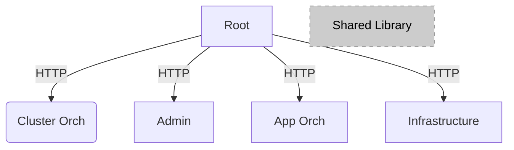

# Orchestrator GUI Web User Interface

## Overview

This implements the web user interface for the Orchestrator,
allowing the user to perform most of the product's features in an intuitive,
visual manner without having to learn all the complexities of the APIs.
That being said, everything the Web UI does and shows comes from the APIs.
This UI is intended for day-to-day edge operators, who want to be able to:

- Register, Onboard and Provision hosts
- Create and manage Clusters
- Create and manage Projects
- Create Deployment Packages
- Deploy and manage Deployments
- Create applications and view and edit them in a catalog
- Schedule maintenance windows
- View alerts
- View the state of the system
- View Cluster templates and import new templates

## Get Started

## Edge Orchestrator Micro Front Ends

This project is a "mono-repo" example of micro front ends (MFEs),
with a minimal amount of configuration per project.

> Note that MFEs and libraries are being moved to independent repositories.

There are 5 apps in this repository:

- root - Glues everything together, displays the other apps
- app-orch - Manages the Application Catalog and Deployments
- cluster-orch - Manages the Clusters
- infra - Manages the Hosts (Edge Infrastructure)
- admin - The administrator features (settings and alerts)

In addition, there is a common library that is shared across all apps.

(Note: All sub-projects are React-based)

Read more about Orchestrator GUI Web User Interface in the [User Guide](https://website-name.com).

See the [Documentation](https://website-name.com) to get started using
Orchestrator GUI Web User Interface.

## License

Orchestrator GUI Web User Interface is licensed under [Apache 2.0 License](LICENSES/Apache-2.0.txt).

Last Updated Date: {April 03, 2025}
