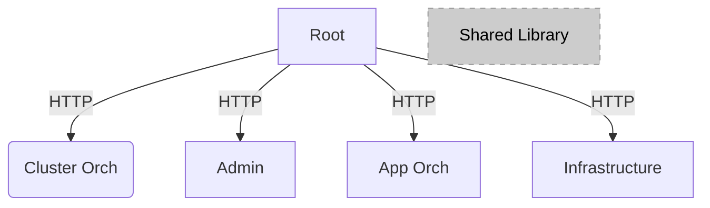

# Edge Orchestrator UI Architecture Guide

## Background

This document provides a high-level overview of the web application managing Edge Orchestrator and its applications, clusters, and hosts-related features.

## Target Audience

The content of this document is intended for developers looking to contribute to the user interface and obtain a high-level understanding of its technical makeup.

## Architecture Diagram

Edge Orchestrator UI consists of multiple micro front ends (MFEs) managed by one 'root' level parent MFE. There are three edge management-related MFEs: application orchestration (app-orch), cluster orchestration (cluster-orch), and infrastructure, as diagrammed below. In addition, an admin MFE drives the management of items used across the ecosystem, such as projects, OS profiles, SSH keys, and more. Reusable elements (tables, dropdowns, lists, etc.) come from the `Shared Library` and are used throughout.

### Key Components

A high-level breakdown of Edge Orchestrator UI MFEs includes the following:

1. Root - entry point of the application. From here, all other MFEs are integrated and navigated to.

2. Application Orchestrator (App Orch) - facilitates the composite creation and deployment of packages for hosts. Packages can include multiple applications and their relevant information.

3. Cluster Orchestrator (Cluster Orch) - facilitates the management of clusters. Allows the creation of new ones and identifying compatible hosts to work with.

4. Infrastructure - facilitates the provisioning process for hosts. Allows attributes such as location metadata, SSH keys, and operating system to be configured in single or multi-host configurations.

5. Admin - helps manage data and options used across the ecosystem, such as Operating Systems, cluster templates, SSH keys, and more.

## Technology Stack

Each MFE is written with [React](https://react.dev/) using [TypeScript](https://www.typescriptlang.org/). Integration of each is done through [Module Federation](https://module-federation.io/guide/start/) to create consumable JavaScript bundles from one MFE to another. This is achieved through the web bundling technology being used, [webpack](https://webpack.js.org/).

### State Management

Sharing data and persisting state across the different MFEs is achieved with [react-redux](https://react-redux.js.org/), with its [redux-toolkit](https://redux-toolkit.js.org/) helping in generating hooks for API calls.

### Testing

[Cypress](https://www.cypress.io/) is used for testing code. Component-level tests are created to ensure individual elements of the UI can work in isolation. End-to-end tests are written to test the UI as a whole. Both varieties of testing are integrated into the CI/CD process with captured screenshots and videos of any failures during the process.

Page Object Model (POM) files are used to abstract the underlying implementation of elements and depend only on selectors in the markup to facilitate complex actions such as _selecting a specific row of a table_ as required in test files ([more info](https://www.browserstack.com/guide/cypress-page-object-model)).

### Component Organization

This project makes use of [atomic design](https://bradfrost.com/blog/post/atomic-web-design/) to classify the complexity and size of UI elements in a molecular manner. The smallest would be atomic and grow from there to molecule, organism, and finally pages.

## Integrations

Edge Orchestrator UI make use of API gateway mappings to simplify management of the numerous endpoints used. These mappings stem from the [tenancy-api-mapping](https://github.com/open-edge-platform/orch-utils/tree/main/tenancy-api-mapping) repository and include API's for the following:

- Application Catalog
- Application Deployment Manager
- Application Resource Manager
- Application Utilities
- Cluster Manager
- Infrastructure
- Metadata-broker
- Observability Monitor

The UI facing code for each of these is created through [RTK's auto-code generator](https://redux-toolkit.js.org/rtk-query/usage/code-generation)

## Authentication

Amongst all pages of the UI the `AuthWrapper` component checks credentials a visiting user has. When the UI sees that the user is not logged in, a redirect is triggered to Keyloak for credential entry.

When access is granted the `SessionTimeout` component kicks off an idle timer of 1hr before automatically logging out the user.
