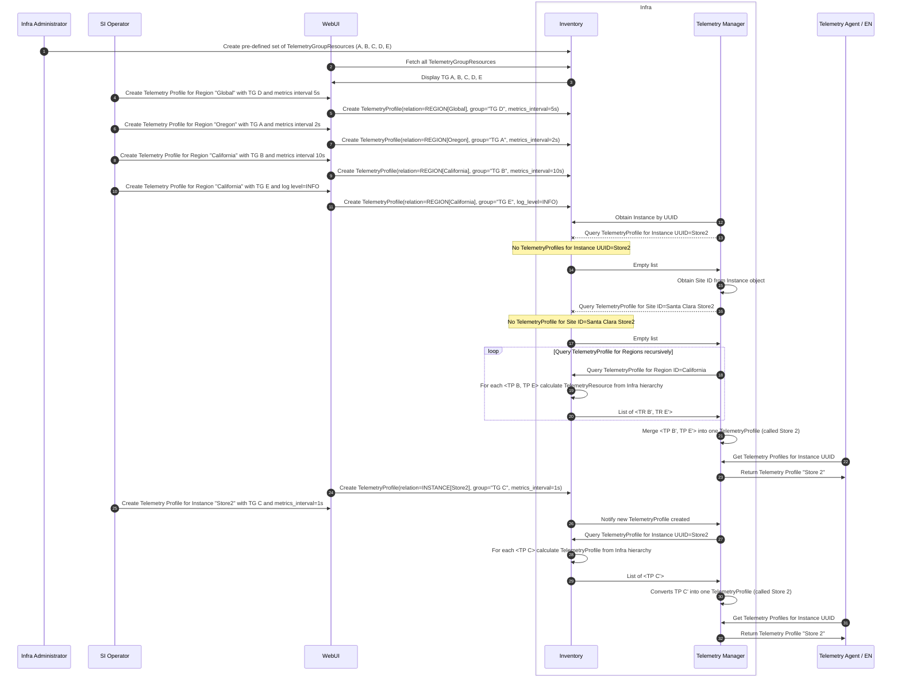

<!---
  SPDX-FileCopyrightText: (C) 2025 Intel Corporation
  SPDX-License-Identifier: Apache-2.0
-->

# Telemetry configuration workflow

This file describes the workflow between Telemetry RM and Inventory to generate Telemetry Profiles that are later
passed down to Telemetry Agent and Edge Nodes.

See [Telemetry Manager](ADD LINK TO DESIGN DOC/ADR).

## Inventory data model for Telemetry

The Inventory data model defines two telemetry-related resources:

- `TelemetryGroupResource` - contains the definition of static telemetry configurations (e.g., metric groups, log
groups, etc.). It has no relations and defines a list of possible telemetry configurations that we can have in the
Infra system. A set of pre-defined `TelemetryGroupResource`s are created via API by the Tenant Controller.
- `TelemetryProfile` - defines a "runtime" telemetry configuration, along with the relationship between
`TelemetryGroupResource` and Instance, Site or Region. Additionally, it defines runtime parameters such as metrics
interval/latency or log level.
  
The Telemetry RM should always query `TelemetryProfile`s. `TelemetryGroupResource`s can be fetched by UI to display
possible telemetry configuration to users.

The Inventory can return *a list* of `TelemetryProfile`s for a given Instance UUID. In that case, the Telemetry RM is
responsible for merging multiple `TelemetryProfile`s
into a single Telemetry Profile (according to rules described in ADR) that will be passed down to Telemetry Agent.

## Generating TelemetryResource from Infra hierarchy

TBD

## Workflow

TelemetryGroupResources:

- TG A - metric_groups="mem", kind=METRICS
- TG B - metric_groups="net", kind=METRICS
- TG C - metric_groups="disk", kind=METRICS
- TG D - metric_groups="cpu", kind=METRICS
- TG E - log_groups="kmsg", kind=LOGS

TelemetryProfiles:

- TP A - metric_interval=2s, TelemetryGroup=TG A, relation=REGION (Oregon)
- TP B - metric_interval=10s, TelemetryGroup=TG B, relation=REGION (California)
- TP C - metric_interval=1s, TelemetryGroup=TG C, relation=INSTANCE (Store2)
- TP D - metric_interval=5s, TelemetryGroup=TG D, relation=REGION (global)
- TP E - log_level=INFO, TelemetryGroup=TG E, relation=REGION (California)

1. SI Admin uses Infra API to create TelemetryGroupResources A, B, C, D, E.
2. UI uses Infra API to get all TelemetryGroupResources and display them.
3. N/A
4. User selects Region "Global" and assigns TelemetryGroupResource "TG D" to it.
5. UI calls Infra API to create TelemetryProfile  with Region="Global", TelemetryGroupResource="TG D", and
metrics_interval=5s.
6. User selects Region "Oregon" and assigns TelemetryGroupResource "TG A" to it.
7. UI calls Infra API to create TelemetryProfile with Region="Oregon" and TelemetryGroupResource="TG A" and
metric_latency=5s.
8. User selects Region "California" and assigns TelemetryResource "TR B" to it.
9. UI calls Infra API to create TelemetryProfile with Region="California" and TelemetryGroupResource="TG B".
10. User selects Region "California" and assigns TelemetryResource "TR E" to it.
11. UI calls Infra API to create TelemetryProfile with Region="California" and TelemetryGroupResource="TG E" and .
12. Telemetry RM obtains from Inventory the Instance object by its UUID.
13. Telemetry RM starts to build the Telemetry Profile for Instance "Store2". First, it performs a List query for
TelemetryProfile filtered by Instance UUID.
14. Inventory doesn't have any TelemetryProfile associated with the Instance. Returns an empty list.
15. Telemetry RM inspects the Instance object to get the Site ID from the Host edge field.
16. Telemetry RM performs a List query for TelemetryProfile filtered by Site ID.
17. Again, Inventory doesn't have any TelemetryProfile associated with the Site. Return an empty list.
18. Telemetry RM inspects the Instance object to get the Region ID from Host->Site->Region. It performs a List query
for TelemetryProfile filtered by Region ID. It repeates querying by Region IDs for all parent regions until there is
no parent.
19. Inventory finds two TelemetryProfiles (TP B, TP E) associated with the Region ID = "California". It also adds
TelemetryProfiles from Infra hierarchy. In result, the Inventory will return TP B, TP E and TP D (Global).
20. Inventory returns the list of TP B, TP E and TP D.
21. Telemetry RM received 3-element list. It should merge TP B, TP E and TP D into one Telemetry Profile that should
contain: metric_groups="net, cpu", metric_latency=5s, log_groups="kmsg", log_level=INFO.
22. Telemetry Agent queries Telemetry RM for Telemetry Profile by passing the Instance UUID.
23. Telemetry RM returns the cached Telemetry Profile (metric_groups="net, cpu", metric_latency=5s, log_groups="kmsg",
log_level=INFO). Telemetry Agent applies the configration.
24. User selects Instance "Store 2" and assigns a new TelemetryProfile "TP C" to it.
25. UI calls Infra API to create TelemetryProfile with Instance "Store 2" and TelemetryProfile="TP C".
26. Telemetry RM got notified about the changes in TelemetryProfile resources.
27. Telemetry RM reconciles the Instances and TelemetryProfile resources. It starts from querying TelemetryProfile by
Instance UUID.
28. This time the Inventory does contain TelemetryProfile for Instance UUID (TP C: metric_groups="disk",
metric_latency=1s). However, the Inventory traverses the Infra hierarchy (takes TP B and TP E from Region "California"
and TP D from Region "Global"):
29. Inventory returns TP C, TP B, TP E and TP D. Other steps are the same as 21-23.
