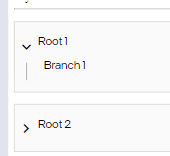

# Orch UI Component Library - Tree

The Orch tree is composed of 3 components with different responsibilities detailed below

- `<Tree />` - the driving component, the 'container' of the tree. It requires a data structure of `branches` (explained below) to be passed in along with a definition to its `onExpand` callback to define what happens when branches are expanded

- `<TreeBranch />` - the individual interactive pieces of the tree. Not meant for individual use, these are dynamically generated from the `branches` structure passed in to the top level tree component.

- `<TreeExpander />` - each branch is associated to an expander which handles the decision to show the expanding icons along with drawing the horizontal/vertical segments that visualize the tree together.

## Interfaces

### TreeNode

```ts
interface TreeNode {
  id: string;
}
```

All nodes (branches) of the tree are required to have a unique identifier associated to them. The data passed in to the `branches` structure should extend this interface if it doesn't already include an `id` property. This will allow correct branch selection for the `onExpand` callback when interacting (expanding/collapsing) the different nodes. Not doing so or having duplicate ids will result in an error.

### TreeBranchProps ...the underyling `branches`

The structure of a tree branch consists of the following

```ts
interface TreeBranchProps<NodeData extends TreeNode> {
  data: NodeData;
  content: React.ReactElement;
  isExpanded?: boolean;
  isLoading?: boolean;
  isLeaf?: boolean;
  isRoot?: boolean;
  children?: TreeBranchProps<NodeData>[];
}
```

`NodeData` is the name of the generic (instead of just using a letter like, T), notice it extends TreeNode

`data` - concrete representation of the data object

`content` - allows JSX definition of the look of a specific branch.

`isExpanded` - by default false, use if you're going to automatically expand tree branches (e.g. search results)

`isLoading` - by default false, use if you want a spinner to appear in cases where a banch may be loading.

`isLeaf` - by default false, indicates no further children and will hide 'expand' button

`isRoot` - by default false, meant for top level items, will draw a gray containing rectangle to match current UX

`children` - by default [], allows further definition of nested children

### TreeBranchProps Example

```tsx
const roots: TreeBranchProps<TreeNode>[] = [
  {
    children: [
      {
        content: <div>Branch 1</div>,
        data: { id: "branch1" },
        isLeaf: true
      },
    ],
    content: <div>Root 1</div>,
    data: { id: "root1" },
    isRoot: true,
    idExpanded:true
  },
  {
    content: <div>Root 2</div>,
    data: { id: "root2" },
    isRoot: true,
  },
];

const onExpand = (data:TreeNode) =>{
    //Possible logic to call API for children related to branch
    //Followed by updating tree data
}

<Tree branches={roots} onExpand={onExpand}> />
```

#### Results



## Updating the tree

Whenever a tree branch is expanded the `onExpand` callback is triggered with a `NodeData` parameter representing the branch clicked. This gives you an opportunity to find (via helper function) where in the tree data structure the item exists so that new child updates can be made. The below deails these steps.

```js
//This will be the initial data structure supporting the tree (root branches should be set here)
const [treeBranchProps, setTreeBranchProps] =
  useState < TreeBranchProps < NodeData > [] > [];

const onExpand = (data: TreeNode) => {
  const node = TreeUtils.find(treeBranchProps, data.id); //recursive helper to find its data
  node.children = [
    {
      /*new child1*/
      onExpand: onExpand //assuming your next branch will have similar expansion logic you will need to have the new child point to this method
    },
    {
      /*new child2*/
      onExpand: onExpand
    },
  ];
  setTreeBranchProps([...treeBranchProps]); //updates the reference
};
//...
//.
//.
return <Tree branches={roots} onExpand={onExpand}> />
```
